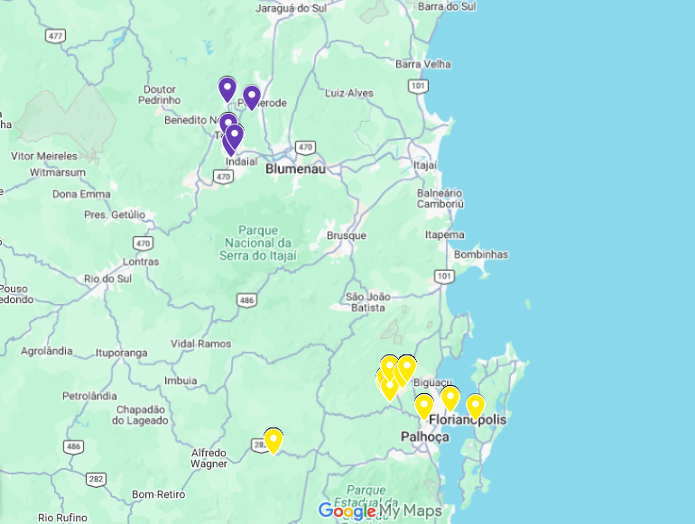

# 2º Simulado Geral da Defesa Civil de Santa Catarina com Meshtastic

No dia 01/03/2026 ocorreu em Santa Catarina o 2º Simulado Geral de Gestão de Desastres que envolveu cidades do estado inteiro. Para aproveitar essa data o colega Alexandre - PU5KTA teve a iniciativa de chamar pessoas aqui do estado para tentarmos criar uma rede mesh momentanea de comunicação, iniciativa que trouxe entusiasmo a várias pessoas e então decidimos tentar.

<!-- more -->

Tivemos pessoas participando aqui da grande Florianópolis, Vale do Itajaí e litoral norte.

No dia combinado cada um foi para o seu ponto determinado para operar o nó meshtastic e criar a rede.

## Restulados

Esperávamos conseguir criar uma rede única, porém isso não aconteceu. Conforme imagem abaixo criamos duas redes locais, uma na grande Florianópolis e outra no Vale do Itajaí.

 

Cada rede funcionou muito bem, sim, tivemos alguns pacotes perdidos, porém foi um percentual muito baixo, diria que foi um sucesso!
Aqui na grande Florianópolis conseguimos uma conexão direta e sem problemas em uma distância máxima de 42km entre o Morro dos Muller e o Morro da Boa Vista.

## A grande Surpresa!

Por um breve momento, segundos eu diria, conseguimos ter uma conexão direta entre um nó em Antônio Carlos e um nó em Timbó, no Morro Azul com uma distância de 95km! Sim, foi recebemos uma mensagem deles e eles receberam um pacote de posição (GPS) de um nó daqui, porém isso mostra a possibilidade real de conectarmos as duas regiões!

Aqui você pode ver vídeos do dia do simulado:  
[QRG Prepper](https://youtu.be/0494yD6D6NI?si=9N5mqrF2dtIYzrjM)  
[Fortis](https://youtu.be/-NGeWVbiyig?si=SJfLD_D6bn_8hR8V)  
[Sobrevivencialismo](https://youtu.be/srG9zhYAnHA?si=IkvWvF6N3vXFMPmp)  

## E agora?

Isso foi o motivador de criarmos esse site e a comunidade SC-Mesh, pois queremos que essa rede entre regiões seja estabelecida, para isso precisamos de mais pessoas que se interessam por essa tecnologia e dispostas a "fazer acontecer".

Nos vemos na SC-Mesh!

PU5LJA